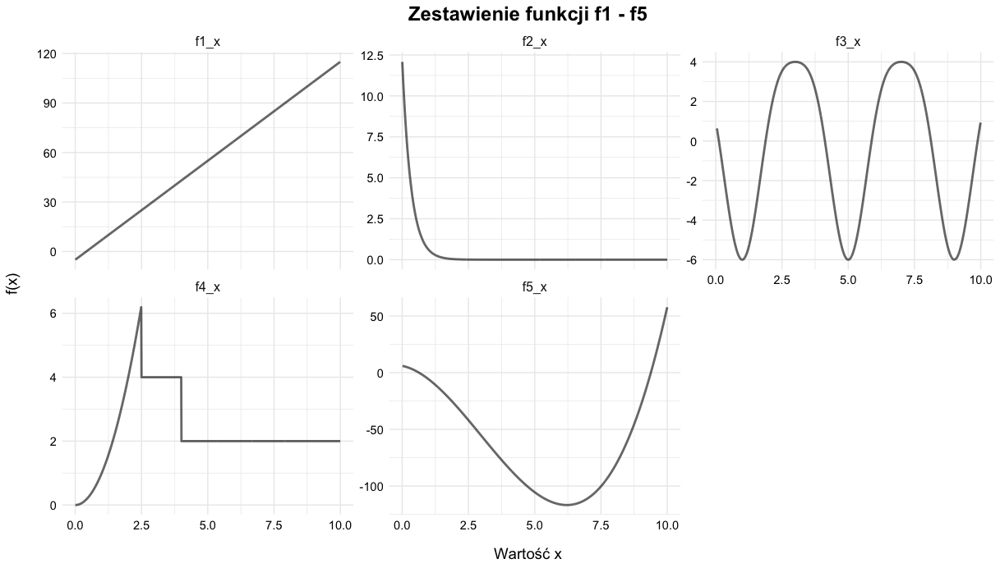

# Analiza efektywnych stopni swobody w uogólnionych modelach addytywnych

English version of repository description is down below.

**[POL]**

Repozytorium zawiera kod napisany w języku R, użyty w mojej pracy magisterskiej, w której zbadano wpływ różnych parametrów uogólnionych modeli addytywnych (ang. *Generalized Additive Models*, GAM) na efektywne stopnie swobody (ang. *Effective Degrees of Freedom*, EDF).

Praca ta została napisana w języku polskim w 2026 r., kiedy byłam studentką studiów drugiego stopnia na Uniwersytecie Wrocławskim (Instytut Matematyki i Informatyki).

### Czym są modele GAM i EDF?

Uogólnione modele addytywne to rozszerzenie klasycznych modeli regresyjnych, które pozwala na modelowanie nieliniowych zależności za pomocą funkcji wygładzających. Stanowią one kompromis pomiędzy wysoką interpretowalnością tradycyjnej regresji a elastycznością złożonych algorytmów uczenia maszynowego.

Efektywne stopnie swobody (EDF) to z kolei miara określająca rzeczywistą złożoność estymowanych efektów w modelu, uwzględniająca nałożoną karę za nadmierną elastyczność. Niskie wartości EDF odpowiadają prostszym, silniej wygładzonym (np. liniowym) relacjom, natomiast wyższe wskazują na bardziej elastyczne i skomplikowane dopasowanie do danych. To właśnie analiza tych wartości stanowi centralny punkt moich analiz.

Celem pracy jest zbadanie, w jaki sposób wybrane parametry modeli GAM wpływają na estymowane efektywne stopnie swobody oraz na jakość odwzorowania rzeczywistych zależności.

W ramach pracy zostały przeprowadzone symulacje Monte Carlo (z wykorzystaniem pakietu `mgcv`), sprawdzające, jak różne parametry modelu wpływają na stabilność EDF oraz jakość odwzorowania rzeczywistych funkcji (mierzoną za pomocą błędu średniokwadratowego – MSE). Testy oparto na pięciu zróżnicowanych typach funkcji:

* **Funkcja liniowa:** $f_1(x) = 12x - 5$
* **Funkcja wykładnicza:** $f_2(x) = 10 e^{-(x^2 - 20)/100 - 3x}$
* **Funkcja trygonometryczna:** $f_3(x) = 5\sin(-0.5\pi x) + \cos(\pi x)$
* **Funkcja „schodkowa”:** 
$$
  f_4(x) = \begin{cases} 
  x^2 & \text{dla } x \le 2,5 \\ 
  4 & \text{dla } x \in (2,5; 4) \\ 
  2 & \text{dla } x \ge 4 
  \end{cases}
$$
* **Funkcja wielomianowa (3. stopnia):** $f_5(x) = 0,9x^3 - 8x^2 - 4,8x + 6$

Funkcje zostały przedstawione na poniższym wykresie.

### Struktura repozytorium

Repozytorium zawiera główny folder `Analyses`, w którym umieszczono 4 podfoldery odpowiadające poszczególnym analizom (ich szczegółowe omówienie znajduje się w części symulacyjnej pracy):

* `A_Analysis` – **Analiza A:** Wpływ kryteriów wygładzania.
* `B_Analysis` – **Analiza B:** Wpływ parametrów $\gamma$ i $k$.
* `C_Analysis` – **Analiza C:** Wpływ wyboru rodzaju bazy splajna.
* `D_Analysis` – **Analiza D:** Wpływ zmiennych nieistotnych (badanie wpływu zwiększania liczby zmiennych szumowych w modelu – zarówno skorelowanych, jak i nieskorelowanych z prawdziwymi zmiennymi objaśniającymi).

W każdym z powyższych podfolderów znajdują się dwa główne pliki (gdzie `x` odpowiada literze danej analizy):

* `Analysis_x_generate.R` – skrypt przeprowadzający symulacje z wykorzystaniem obliczeń wielowątkowych.
* `Analysis_x_results.R` – skrypt służący do opracowania i wizualizacji wyników (generowanie wykresów).

Ponadto w repozytorium znajduje się folder `Theory`, który zawiera skrypty generujące wykresy użyte w teoretycznej części pracy, oraz plik `Data.zip` ze skompresowanymi wynikami symulacji.

**[ENG]**

This repository contains the R code used in my Master's thesis, which investigates the impact of various parameters of Generalized Additive Models (GAM) on the Effective Degrees of Freedom (EDF).

This thesis was written in Polish in 2026, while I was a Master's student at the University of Wrocław (Institute of Mathematics and Computer Science).

### What are GAM and EDF?

Generalized Additive Models are an extension of classical regression models that allow for modeling non-linear relationships using smoothing functions. They strike a balance between the high interpretability of traditional regression and the flexibility of complex machine learning algorithms.

Effective Degrees of Freedom (EDF), in turn, is a measure that defines the actual complexity of the estimated effects in the model, taking into account the applied penalty for excessive flexibility. Low EDF values correspond to simpler, more heavily smoothed (e.g., linear) relationships, while higher values indicate a more flexible and complex fit to the data. The analysis of these values is the focal point of my research.

The aim of the thesis is to examine how selected parameters of GAMs influence the estimated effective degrees of freedom and the quality of reconstructing the true relationships.

As part of the thesis, Monte Carlo simulations were conducted (using the `mgcv` package) to verify how different model parameters affect the stability of EDF and the quality of reconstructing the true functions (measured by the Mean Squared Error – MSE). The tests were based on five diverse types of functions:

* **Linear function:** $f_1(x) = 12x - 5$
* **Exponential function:** $f_2(x) = 10 e^{-(x^2 - 20)/100 - 3x}$
* **Trigonometric function:** $f_3(x) = 5\sin(-0.5\pi x) + \cos(\pi x)$
* **"Step" function:** 
$$
  f_4(x) = \begin{cases} 
  x^2 & \text{for } x \le 2.5 \\ 
  4 & \text{for } x \in (2.5; 4) \\ 
  2 & \text{for } x \ge 4 
  \end{cases}
$$
* **Polynomial function (3rd degree):** $f_5(x) = 0.9x^3 - 8x^2 - 4.8x + 6$

The functions are presented in the plot below.

### Repository Structure

The repository contains the main `Analyses` folder, which includes 4 subfolders corresponding to individual analyses (their detailed discussion can be found in the simulation part of the thesis):

* `A_Analysis` – **Analysis A:** The impact of smoothing criteria.
* `B_Analysis` – **Analysis B:** The impact of the $\gamma$ and $k$ parameters.
* `C_Analysis` – **Analysis C:** The impact of the choice of spline basis type.
* `D_Analysis` – **Analysis D:** The impact of irrelevant variables (examining the effect of increasing the number of noise variables in the model – both correlated and uncorrelated with the true explanatory variables).

Each of the above subfolders contains two main files (where `x` corresponds to the letter of the given analysis):

* `Analysis_x_generate.R` – A script that runs the simulations using multi-threaded computing.
* `Analysis_x_results.R` – A script used for processing and visualizing the results (generating plots).

Additionally, the repository contains a `Theory` folder, which includes scripts generating the plots used in the theoretical part of the thesis, as well as a `Data.zip` file containing the compressed simulation results.